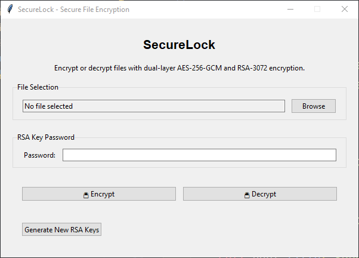

# SecureLock

**CS 005 Final Laboratory Project**

A secure, offline file encryption/decryption tool with dual-layer cryptography and self-destruct capability.



## Project Overview

This project was developed as a Final Laboratory Project for CS 005 (Information Security). It addresses the following Student Outcomes:

- **SO 2:** Design, implement, and evaluate a computing-based solution to meet a given set of computing requirements in the context of the program's discipline.
- **SO 4:** Recognize professional responsibilities and make informed judgments in computing practice based on legal and ethical principles.

SecureLock implements two distinct cryptographic algorithms (AES-256-GCM and RSA-3072) for information security, with an added **self-destruct feature** that permanently removes encrypted files after three failed decryption attempts to enhance data protection.

## Features

- **Strong Dual-Layer Encryption**

  - AES-256-GCM for fast, secure file encryption
  - RSA-3072 for secure key protection
  - Complete offline operation - no internet connection required

- **Self-Destruct Mechanism**

  - Files automatically delete after 3 failed decryption attempts
  - Prevents brute-force attacks on encrypted content

- **Robust Security Measures**

  - SHA-256 file integrity validation
  - Password-protected RSA private key
  - GCM authentication tags to detect tampering

- **Simple, Cross-Platform Interface**
  - Easy-to-use GUI built with Tkinter
  - Compatible with Windows, macOS, and Linux

## Requirements

- Python 3.10 or newer
- PyCryptodome library (automatically installed with setup)

## Installation

### Option 1: From Source

1. Clone the repository or download the source code:

   ```
   git clone https://github.com/yourusername/securelock.git
   cd securelock
   ```

2. Install dependencies:

   ```
   pip install -r requirements.txt
   ```

3. Run the application:
   ```
   python securelock.py
   ```

### Option 2: Standalone Executable (Windows only)

1. Download the latest `SecureLock-Setup.exe` from the [Releases](https://github.com/yourusername/securelock/releases) page
2. Run the installer and follow the on-screen instructions
3. Launch SecureLock from the Start menu or desktop shortcut

## Usage Guide

### First-Time Setup

When you first launch SecureLock, you'll be prompted to generate your RSA key pair:

1. Click "Yes" when prompted to generate a new key pair
2. Enter a strong password to protect your private key (must be at least 8 characters)
3. Confirm your password
4. Click "Generate Keys"

**IMPORTANT:** Remember this password! If you lose it, you won't be able to decrypt any files.

### Encrypting a File

1. Click "Browse" and select the file you want to encrypt
2. Click "🔒 Encrypt"
3. The encrypted file will be saved with a `.securelock` extension in the same directory as the original file

### Decrypting a File

1. Click "Browse" and select a `.securelock` file
2. Enter your RSA private key password in the password field
3. Click "🔓 Decrypt"
4. The decrypted file will be saved in the same directory with a `_decrypted` suffix

### Self-Destruct Mechanism

- Each `.securelock` file has a counter tracking failed decryption attempts
- After 3 failed attempts (usually from incorrect passwords), the encrypted file is permanently deleted
- You will see a warning showing remaining attempts after each failed decryption

### Generating New RSA Keys

If you want to generate a new RSA key pair (will not affect already encrypted files):

1. Click the "Generate New RSA Keys" button
2. Follow the same procedure as the first-time setup

## Security Details

### Encryption Process

1. **Preparation**:

   - Random 256-bit AES key is generated
   - File contents are read into memory
   - SHA-256 hash of original file is calculated for integrity validation

2. **First Layer - AES-256-GCM**:

   - File is encrypted with AES-256 in GCM mode
   - Authentication tag is generated to detect tampering

3. **Second Layer - RSA-3072**:

   - AES key is encrypted with your RSA public key
   - Only someone with the private key (protected by your password) can recover the AES key

4. **Storage**:
   - Metadata (including encrypted AES key, nonce, and authentication tag) is stored in a JSON header
   - Encrypted file content is appended after the header
   - Everything is saved with a `.securelock` extension

### Decryption Process

1. **Authorization**:

   - You enter your RSA private key password
   - System tracks decryption attempts to enforce self-destruct policy

2. **Key Recovery**:

   - RSA private key decrypts the AES key

3. **File Recovery**:

   - AES-GCM decrypts the file content and verifies authentication tag
   - SHA-256 hash validation ensures file integrity

4. **Output**:
   - Decrypted file is saved with original filename plus a `_decrypted` suffix

## Security Considerations

- **Password Strength**: Use a strong, unique password to protect your RSA private key
- **Key Backup**: Consider backing up your `keys/` folder to prevent accidental loss
- **Memory Limits**: Very large files might cause memory issues since encryption happens in-memory
- **Private Key Protection**: The RSA private key is encrypted, but keep the `keys/` directory secure

## Technical Details

- **Encryption**: AES-256-GCM + RSA-3072-OAEP
- **Hashing**: SHA-256
- **Key Protection**: Private key encrypted with PKCS#8, using scrypt for key derivation
- **File Format**: Custom `.securelock` format with JSON metadata header

## Limitations

- Large files (>2GB) may cause memory issues since processing is done in-memory
- Password recovery is not possible - if you lose your RSA key password, encrypted files cannot be recovered
- Mac users may need to grant permission for the application to access files

## Troubleshooting

### Common Issues

- **"No module named 'Crypto'"**: Install the required dependencies with `pip install -r requirements.txt`
- **"RSA key not found"**: Check if the `keys/` directory exists and contains `public.pem` and `private.pem`
- **"Failed to decrypt file"**: Make sure you're using the correct password for your RSA private key
- **File won't decrypt**: If you've reached 3 failed attempts, the file has been deleted by the self-destruct mechanism

### Getting Help

If you encounter issues not covered here, please [open an issue](https://github.com/yourusername/securelock/issues) with details about the problem.

## License

This project is licensed under the MIT License - see the [LICENSE](LICENSE) file for details.

## Acknowledgments

- PyCryptodome for cryptographic operations
- Python Tkinter for the GUI framework
- Inspired by cybersecurity best practices and the need for secure local file encryption

## Disclaimer

This software is provided for educational and legitimate security purposes only. Always use encryption responsibly and in compliance with applicable laws and regulations.
